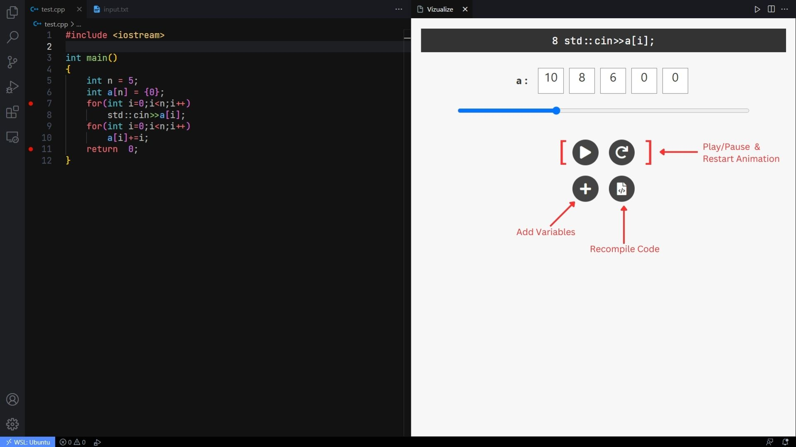

# **Vizualize**

Bring your code to life with our visualisations!

### **Using the Extension**
- Open the concerned **C++** file in VS Code, the file extension must be `.cpp` .
- Mark start and end breakpoints in your code.
- Run the Vizualize command either by the shortcut <kbd>Ctrl</kbd>+<kbd>Alt</kbd>+<kbd>Z</kbd>  (<kbd>⌘</kbd>+<kbd>Alt</kbd>+<kbd>Z</kbd> for Mac) or by searching through the commands list †.
- Select suitable choices for the proceeding prompts.

In the animation window, there are options to play, pause & restart the animation. It also options to add more variables to watch-list and an option to recompile code to reflect any changes made to the code/breakpoints.

#### Watch Variable Options
- *Numerical Arrays (or equivalent)* - These include arrays, vectors (and other similar datatypes) of any numerical datatype like int, double, etc.
- *String Arrays (or equivalent)* - Similar to the above option, just for string datatype.
- *Iterator to an Array* - Adds highlights to the arrays, generally useful for indices.
- *Numerical Variable* - Any type of numerical variable of type int, long, float, double, etc.
- *String Variable* - Normal string of text.

Only C++ files are supported.

† Commands List can be opened by the shortcut <kbd>Ctrl</kbd>+<kbd>Shift</kbd>+<kbd>P</kbd>  (<kbd>⌘</kbd>+<kbd>Shift</kbd>+<kbd>P</kbd> for Mac).
### **Requirements**
- Visual Studio Code (obviously)
- `g++` - A stable compliant version of the `g++` compiler
- `gdb` - GNU Debugger (Recommended Version 12.1 or newer)

Check whether your system has the above requirements with the following commands, they should return their version info if available else some error about the inavailability of the specified requirements:
- `code --version`
- `g++ --version`
- `gdb --version`

### **Contributing**

#### Steps to run the extension using the source code

- Download the source code from GitHub or clone [the repository](https://github.com/sanidhyas3s/Vizualize) using `git clone`.
- Open the project directory in VS Code either through the GUI or through the terminal using the command `code vizualize` from the parent directory of the project directory(vizualize).
- Run the extension through the option `Debug: Start Debugging` from the commands list (<kbd>Ctrl</kbd>+<kbd>Shift</kbd>+<kbd>P</kbd> / <kbd>⌘</kbd>+<kbd>Shift</kbd>+<kbd>P</kbd>) or alternatively using the keyboard shortcut <kbd>F5</kbd> for the same.
- Now, in the `Extension Development Host` environment, you would have our extension activated. The extension would not be enabled globally in VS Code through this method.

It should be noted that the `node_modules` folder is included in the repository, as it is a relatively lightweight component of our project. However, should you choose not to download this folder, you can run the command `npm i` to install it.

Contributions to the project are absolutely welcome. If you find a bug, have a feature request, or want to contribute code, please submit an issue or pull request on the [project's GitHub page](https://github.com/sanidhyas3s/Vizualize).

No one writes perfect code, like we help you find bugs in your code, you can also help us find bugs in ours!

---